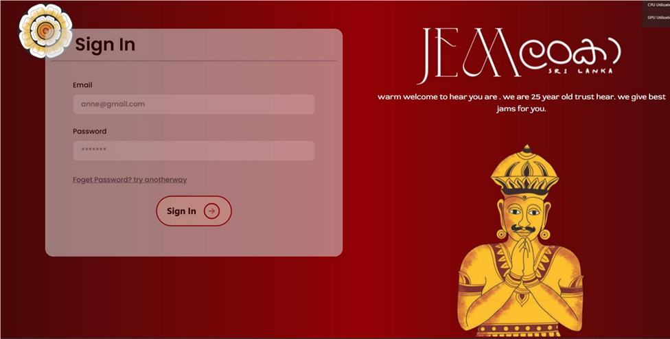
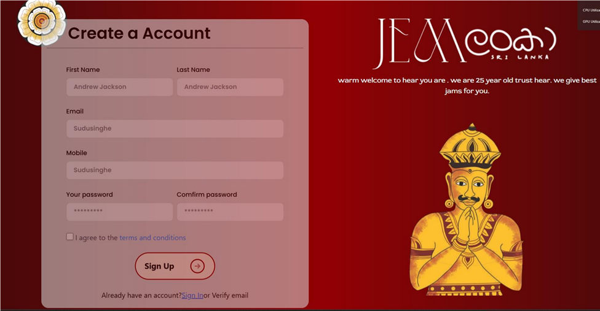
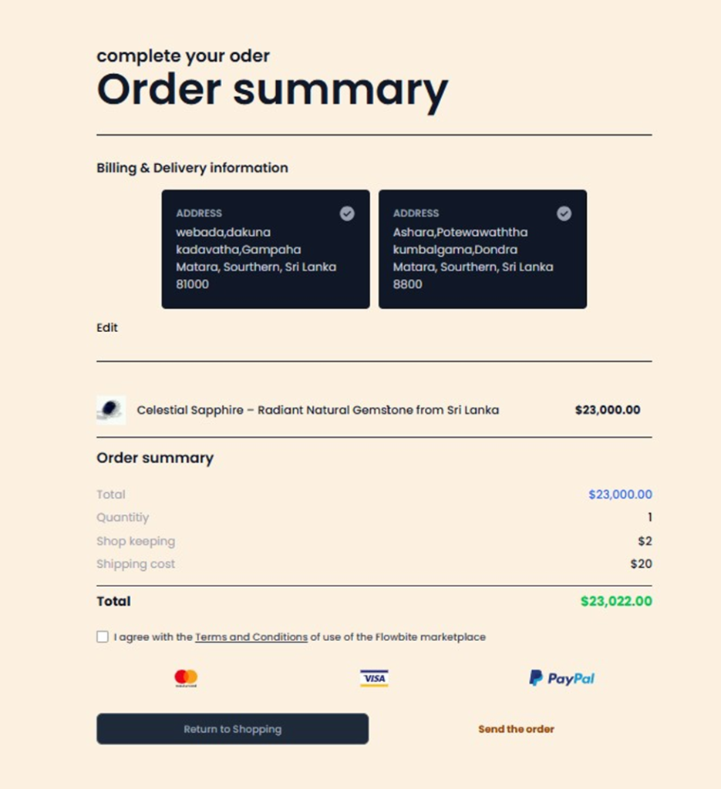
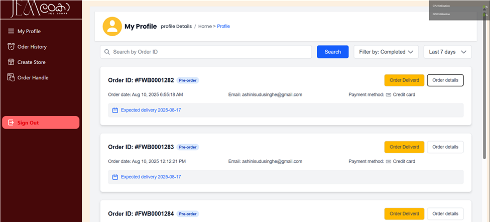
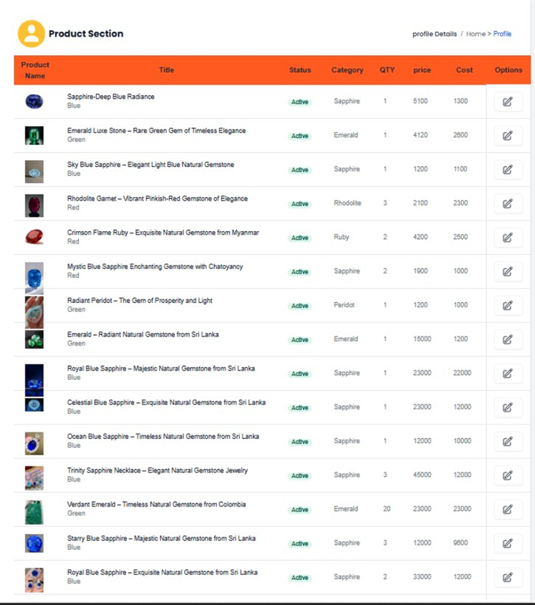
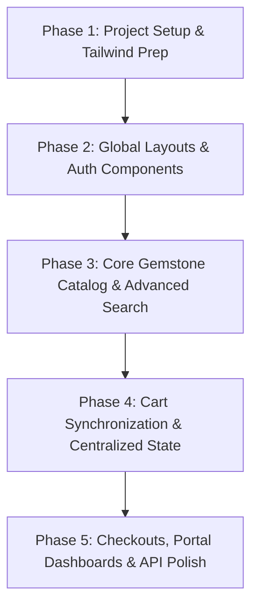

# 💎 JEM Lanka — Premium Sri Lankan Gemstone Marketplace

JEM Lanka is a high-end, state-of-the-art e-commerce platform and vendor marketplace dedicated to sourcing and retailing natural gemstones directly from the rich mines of Sri Lanka. Offering premium items like Celestial Sapphires, Emeralds, and Rubies, the platform connects discerning buyers with authorized sellers under a verified trust banner.

---

## 📸 System Screenshots

Here is a visual showcase of the JEM Lanka user interface and key workflows:

### 🔐 1. Sign In Portal
Secure entry page for customers, vendors, and administrators.


### 📝 2. User Account Registration
Seamless sign-up onboarding form featuring profile information collection and terms agreement.


### 🛒 3. Checkout & Order Summary
A billing summary page with shipping address verification, item calculations, and payment gateway options (Visa, MasterCard, PayPal).


### 📦 4. Order Tracking & Operations Dashboard
Real-time customer order management dashboard detailing status updates (e.g., Pre-order, Completed), payment types, and expected delivery tracking.


### 🏷️ 5. Product Management Panel
Authorized vendor panel to review current stone inventory, pricing, cost, available stock quantities, and product active statuses.


---

## 🛠️ Technology Stack

JEM Lanka is designed around a decoupled multi-tier architecture composed of a highly responsive frontend layout and a strong Java EE backend.

### 🎨 Frontend Component
*   **Structure**: Semantic HTML5 markup with responsive layouts.
*   **Styling**: **Tailwind CSS v4** providing a rich, custom-curated palette (deep crimson crimson-reds, HSL-tailored gold/yellow accents, and clean dark modes).
*   **Animations & Carousels**: **Alpine.js** (integrated via lightweight CDN) managing dynamic hero sliders and landing banner transitions.
*   **Logic Controllers**: **Vanilla ES6+ JavaScript** handling asynchronous HTTP communications (`fetch` requests), DOM state modifications, and event-based visual callbacks.

### ☕ Backend Component
*   **Core Engine**: **Java EE Web Servlets** handling custom REST-like endpoints and JSON exchange.
*   **Database Connectivity**: **MySQL Database Engine** accessed securely through **Hibernate 5 ORM** utilizing declarative XML mappings (`hibernate.cfg.xml`) and transactional managers (`HibernateUtil.java`).
*   **Serialization**: **Google GSON Library** for fast, high-performance serialization of POJO lists and entity mappings into JSON.
*   **Security & Interceptors**:
    *   **CORS Request Filters** (`CrosFilter.java`) restricting access to authorized domain origins and handling cookie credential authentication.
    *   **Session Filters** and **SignInCheck Filters** preventing unauthorized access to administration routes.
*   **External Integration**: **JavaMail API** configured via SMTP servers to dispatch secure one-time-passwords (OTP) and transaction confirmations.

---

## 📂 Project Architecture & File Structures

Below is a detailed layout of both directories inside the workspace.

### 🌐 Frontend Directory: `d:\XamppNewFolder\htdocs\jemLanka`
This folder is deployed inside the XAMPP htdocs webserver and serves all consumer views.
```text
jemLanka/
├── .gitignore                   # Excludes node_modules, log files, VS Code state, and local builds
├── package.json                 # Project details & dependency scripts for Tailwind compiling
├── tailwind.config.js           # Configuration specifying Tailwind CSS paths and extensions
├── style.css                    # Global vanilla CSS declarations
├── index.html                   # Main landing page containing gemstone category panels
├── cart.html                    # Shopping cart interface for reviewing pending item lists
├── check-out.html               # Multi-address checkout selection and billing confirmation
├── single-product.html          # Individual gemstone viewing page with detail matrices
├── advance-search.html          # Left-pane search filters (Shape, Color, Clarity, Category, etc.)
├── sign-in.html / sign-up.html  # Authentication interfaces
├── admin-dashboard.html         # Portal index for system administrators
├── add-newproduct.html          # Product listing submission console
├── profile-dashboard.html       # Customer tracking panel for order verification
├── store-register.html          # Registration form to launch authorized gemstone stores
├── purchesHistroy.html          # Customer invoice history records [Legacy Typo Name]
├── vedi-veda.html               # Custom storefront product catalog [Legacy Template]
├── src/
│   ├── input.css                # Raw Tailwind CSS entrypoint containing global directives
│   └── output.css               # Fully compiled, purged production stylesheet
├── js/                          # Javascript controller scripts
│   ├── index.js                 # Dynamic frontpage data-fetching
│   ├── cart.js                  # Local/Remote cart operations
│   ├── checkout.js              # Checkout address handler
│   ├── notification.js          # Reusable Toast Notification API
│   ├── saerch.js                # Gemstone multi-faceted search operations [Legacy Typo Name]
│   └── singal-productview.js    # Single item interactive page controller [Legacy Typo Name]
└── resources/
    └── screenshots/             # Embedded visual assets for system documentation
        ├── signin.png
        ├── signup.png
        ├── checkout.png
        ├── dashboard_orders.png
        └── dashboard_products.png
```

### ⚙️ Backend Directory: `d:\ApowerRECData\JemLankaBackEnd`
This Java Web Application contains all secure business rules, Hibernate entities, and controllers.
```text
JemLankaBackEnd/
├── .gitignore                   # Excludes build/, dist/, NB private profiles, classes, packages
├── build.xml                    # Ant build instructions for NetBeans compiling
├── src/java/
│   ├── hibernate.cfg.xml        # DB properties, JDBC credentials, and mapping source links
│   ├── controller/              # Java Servlets representing transaction controllers
│   │   ├── SignIn.java          # Validates credentials against Hibernate databases
│   │   ├── SingUp.java          # Registers accounts and requests email validation
│   │   ├── VerifyEmail.java     # Validates client inputs against stored session OTP hashes
│   │   ├── AddToCart.java       # Coordinates cart addition logic and item availability
│   │   ├── SaveProduct.java     # Sanitizes parameters and uploads stone product images
│   │   ├── SearchProductsHere.js# Evaluates active HQL queries based on search flags
│   │   └── CheckOut.java        # Processes transactional address selections
│   ├── model/                   # Support utilities and global filters
│   │   ├── CrosFilter.java      # Configures Cross-Origin Resource Sharing rules
│   │   ├── SignInCheckFilter.js # Security filter to block unauthorized servlet requests
│   │   ├── Mail.java            # Formats and delivers custom Gmail SMTP OTP notices
│   │   └── Util.java            # Cryptographic and parameter utility helpers
│   └── hibernate/               # Auto-mapped Hibernate Entities (POJOs)
│       ├── HibernateUtil.java   # Configures and instantiates the global SessionFactory
│       ├── User.java            # Client profile credentials
│       ├── Product.java         # Gemstone catalog listing entity
│       ├── Category.java / Shape.java / Color.java / Clarity.java / Treatment.java
│       ├── Store.java           # Vendor storefront attributes
│       └── Orders.java          # Client transaction tracking
```

---

## 🚀 Core Features

1.  **Direct OTP Authentication Flow**: Integrates secure SMTP verification. During registration, users receive a verified 6-digit passcode to active their email prior to account creation.
2.  **Advanced Gemstone Search sidebar**: Deep relational filtering system using dynamic Hibernate HQL builders. Allows search queries based on Shape, Color, Clarity, Treatment, and price range.
3.  **Shopping Cart & Persistence**: Seamless frontend interface working directly with active cookies and DB synchronizations.
4.  **Authorized Vendor Stores**: Customers can register customized gemstone stores, permitting them to manage their inventory and trace sales independently.
5.  **Multi-Address Delivery Selector**: Automatically pulls location parameters (Provinces, Cities) from mapped MySQL entities, helping users manage several billing profiles easily.
6.  **Interactive Notification System**: Implements a reusable custom Toast API to inform users of active operations (e.g., successful additions, checkout errors) dynamically.

---

## 🔧 Applied Bug Fixes & Rectified Errors

Several critical runtime and compile-time issues have been successfully identified and corrected during our codebase audit:

### 1. Resolved Java Compiler Mismatch in `CrosFilter.java`
*   **Problem**: `CrosFilter.java` was situated under the `src/java/model/` directory but lacked any package declaration, throwing a blocking package-mismatch compilation error.
*   **Resolution**: Added `package model;` at the absolute top of the source, allowing successful compilation within standard servlet containers.

### 2. Corrected Hardcoded File Upload Path in `SaveProduct.java`
*   **Problem**: In `SaveProduct.java` (line 210), the absolute directory to save uploaded stone images was hardcoded to `D:\xampp03\htdocs\jemLanka\productImage`. Since the active development layout runs under `D:\XamppNewFolder`, this caused image upload failures.
*   **Resolution**: Updated the path base to `D:\XamppNewFolder\htdocs\jemLanka\productImage`, aligning files perfectly with the active web server directory.

### 3. Fixed Dependency Execution Sequence in `cart.html`
*   **Problem**: In `cart.html`, `js/cart.js` was loaded before `js/notification.js`. Because `cart.js` immediately instantiates the global class `const popup = new Notification();` upon loading, the script crashed with `ReferenceError: Notification is not defined` and stopped cart execution.
*   **Resolution**: Rearranged the tags so that `notification.js` loads first, resolving the order constraint.

### 4. Activated Missing Global Toast Declarations
*   **Problem**: Files `advance-search.html` and `single-product.html` were calling notification prompts (`popup.success` / `popup.error`) without importing `js/notification.js` or instantiating the controller variable inside `saerch.js` and `singal-productview.js`.
*   **Resolution**: Integrated `<script src="js/notification.js"></script>` into the HTML views and uncommented the `const popup = new Notification();` initialization statements inside both scripts.

---

## ⚠️ Legacy Quirks & Technical Debt
To maintain structural compatibility with the existing multi-page system, certain files featuring spelling mistakes have been intentionally kept as-is. These are scheduled to be fully refactored and renamed during the upcoming React frontend migration:
*   **Files with spelling errors**:
    *   `js/saerch.js` (Search controller)
    *   `js/singal-productview.js` (Single product view controller)
    *   `purchesHistroy.html` (Invoice history views)
    *   `all-oders.html` & `js/all-oders.js` (Order listing interface)
    *   `js/order-traking.js` (Tracking controller)

---

## 🗺️ Future Roadmap: React.js Frontend Migration

To transition JEM Lanka into a modern enterprise web app, the current static HTML + Vanilla JS layout will be migrated into a Single-Page Application (SPA) utilizing **React.js**.

### 🌟 Why Migrate to React?
1.  **Component-Based Architecture**: Package buttons, navigation bars, search filters, and cards into reusable UI components to eliminate large code duplication in multiple HTML views.
2.  **Centralized State Management**: Use state containers (like Context API or Redux Toolkit) to synchronise the cart across all views instantly without using manual cookie/storage parsing.
3.  **Client-Side Routing**: Replace heavy browser window refreshes with **React Router DOM**, achieving page switches instantly with smooth transitions.
4.  **Declarative UI**: Ensure dynamic lists (like the gemstone search results) reflect server state changes instantly and cleanly.

### 📋 Phase-by-Phase Migration Plan



#### Phase 1: Vite Project Scaffold & Tailwind Setup
*   Bootstrap a modern project structure utilizing **Vite**:
    ```bash
    npx -y create-vite@latest jem-lanka-frontend --template react
    ```
*   Configure the Tailwind CSS compilation, importing custom colors and typography seamlessly into `tailwind.config.js` or `index.css`.
*   Set up absolute path aliases (e.g. `@/components/*`, `@/hooks/*`) to maintain codebase cleanliness.

#### Phase 2: Common Components & Router Configuration
*   Create a base shell layout including the global premium `Navbar` and `Footer` sections.
*   Configure `React Router DOM` with routes matching the existing layout:
    *   `/` $\rightarrow$ `Home.jsx`
    *   `/signin` $\rightarrow$ `SignIn.jsx`
    *   `/signup` $\rightarrow$ `SignUp.jsx`
    *   `/search` $\rightarrow$ `AdvanceSearch.jsx`
    *   `/product/:id` $\rightarrow$ `SingleProductView.jsx`
    *   `/cart` $\rightarrow$ `Cart.jsx`
    *   `/checkout` $\rightarrow$ `Checkout.jsx`
    *   `/dashboard/*` $\rightarrow$ `AdminDashboard.jsx` / `ProfileDashboard.jsx`

#### Phase 3: Centralized API Services & Authentication Context
*   Configure an **Axios HTTP Client** with a base URL pointing directly to the Tomcat/Glassfish backend (`http://localhost:8080/JemLankaBackEnd/`). Enable global credentials (`withCredentials: true`) to support session tokens and CORS requirements.
*   Establish an `AuthContext` to coordinate user sign-in status, verification OTP states, and administrative session protection globally.

#### Phase 4: State-Driven Cart & Reusable Notification Toasts
*   Migrate the Vanilla JS cookie-handler into a cohesive `CartContext` or `useCart` custom hook, supporting live state updates and instant visual syncs.
*   Rebuild the custom `notification.js` system as a reusable React Toast Provider (e.g., using `react-hot-toast` or a custom Tailwind-based component) accessible throughout the component tree.

#### Phase 5: Dynamic View Conversions & Testing
*   Convert the static search filter arrays into state-bound React components, dynamically calling the `SearchProductsHere` servlet on state changes.
*   Redesign the gemstone product listing matrices as clean, modular card elements, resolving old spelling quirks and maintaining a highly premium aesthetic.
